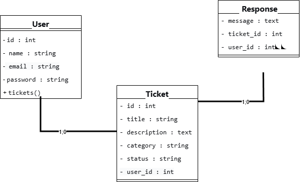

# 🎫 HelpDesk Pro - Plateforme de Ticketing


## 📋 Description du projet

**HelpDesk Pro** est une application web de gestion de tickets support développée avec Laravel dans le cadre d'un projet d'examen. Elle permet aux utilisateurs de créer des demandes d'assistance et aux administrateurs de les gérer efficacement.

L'application propose une **interface moderne** avec des effets 3D sur la page de connexion et un dashboard intuitif.

---

## ✨ Fonctionnalités principales

### 🔐 Authentification
- ✅ Inscription et connexion sécurisées
- ✅ Protection des routes par middleware
- ✅ Gestion de session

### 🎫 Gestion des tickets
- ✅ **Création** de tickets (titre, catégorie, description)
- ✅ **Consultation** de la liste des tickets
- ✅ **Visualisation** du détail d'un ticket
- ✅ **Réponse** aux tickets (commentaires)
- ✅ **Changement de statut** (ouvert, en cours, résolu, fermé)
- ✅ **Suppression** de tickets (admin uniquement)

### 👥 Gestion des rôles
| Rôle | Droits |
|------|--------|
| **Utilisateur** | Créer ses tickets, voir ses tickets, répondre à ses tickets |
| **Administrateur** | Voir tous les tickets, changer les statuts, supprimer des tickets, répondre à tous |

### 🎨 Interface utilisateur
- ✅ Page d'accueil professionnelle
- ✅ Page de connexion avec **effets 3D**
- ✅ Dashboard avec statistiques
- ✅ Design responsive (mobile, tablette, desktop)
- ✅ Thème clair/sombre automatique

---

## 📊 Diagramme de classe UML



### Structure des données

```
+----------------+          +----------------+          +----------------+
|     User       |          |    Ticket      |          |   Response     |
+----------------+          +----------------+          +----------------+
| - id : int     |          | - id : int     |          | - id : int     |
| - name : string|1        *| - title : string|1        *| - message : text|
| - email : string|<-------->| - description  |<-------->| - ticket_id:int |
| - password :   |          | - category     |          | - user_id : int |
+----------------+          | - status       |          +----------------+
| + tickets()    |          | - user_id : int|          | + ticket()      |
| + responses()  |          +----------------+          | + user()        |
+----------------+          | + user()       |          +----------------+
                            | + responses()  |
                            +----------------+
```

### Relations
- **Un utilisateur** peut avoir **plusieurs tickets** (1..*)
- **Un ticket** peut avoir **plusieurs réponses** (1..*)

---

## 👥 Analyse des acteurs

### Acteur 1 : Utilisateur
- Personne qui a besoin d'aide
- Crée des tickets pour signaler un problème

### Acteur 2 : Administrateur
- Personne qui gère les tickets
- Aide les utilisateurs à résoudre leurs problèmes

### Cas d'utilisation

| Acteur | Cas d'utilisation | Description |
|--------|-------------------|-------------|
| Utilisateur | S'inscrire | Créer un compte sur la plateforme |
| Utilisateur | Se connecter | Accéder à son espace personnel |
| Utilisateur | Créer un ticket | Soumettre une nouvelle demande |
| Utilisateur | Voir ses tickets | Consulter la liste de ses demandes |
| Utilisateur | Voir un ticket | Visualiser les détails d'un ticket |
| Utilisateur | Répondre à un ticket | Ajouter un commentaire |
| Administrateur | Voir tous les tickets | Accéder à tous les tickets du système |
| Administrateur | Changer le statut | Modifier l'état d'un ticket (ouvert, en cours, résolu) |
| Administrateur | Supprimer un ticket | Retirer un ticket du système |
| Administrateur | Répondre aux tickets | Ajouter des commentaires à n'importe quel ticket |

### Règles de gestion
- Un utilisateur ne voit **que ses propres tickets**
- L'administrateur voit **tous les tickets**
- Tout le monde peut répondre aux tickets
- Seul l'administrateur peut changer le statut et supprimer
- L'administrateur est identifié par l'email `admin@admin.com`

---

## 🛠️ Technologies utilisées

| Technologie | Version | Utilisation |
|-------------|---------|-------------|
| **Laravel** | 12 | Framework PHP backend |
| **PHP** | 8.2 | Langage de programmation |
| **MySQL** | 8.0 | Base de données |
| **Tailwind CSS** | 3 | Framework CSS |
| **Font Awesome** | 6 | Icônes |
| **Git** | - | Versionning |
| **GitHub** | - | Hébergement du code |

---

## 🔧 Installation et déploiement

### Prérequis
- PHP ≥ 8.2
- Composer
- MySQL
- Node.js (optionnel, pour les assets)

### Étapes d'installation

1. **Cloner le dépôt**
   ```bash
   git clone https://github.com/Godson236/examen_ticketing.git
   cd examen_ticketing
   ```

2. **Installer les dépendances PHP**
   ```bash
   composer install
   ```

3. **Configurer l'environnement**
   ```bash
   cp .env.example .env
   php artisan key:generate
   ```

4. **Configurer la base de données**
   - Créez une base de données nommée `examen_ticketing`
   - Modifiez le fichier `.env` :
   ```
   DB_CONNECTION=mysql
   DB_HOST=127.0.0.1
   DB_PORT=3306
   DB_DATABASE=examen_ticketing
   DB_USERNAME=root
   DB_PASSWORD=
   ```

5. **Lancer les migrations**
   ```bash
   php artisan migrate
   ```

6. **Compiler les assets (optionnel)**
   ```bash
   npm install
   npm run build
   ```

7. **Démarrer le serveur**
   ```bash
   php artisan serve
   ```

8. **Accéder à l'application**
   - URL : http://127.0.0.1:8000

---

## 🔑 Comptes de test

| Rôle | Email | Mot de passe |
|------|-------|--------------|
| **Administrateur** | `admin@admin.com` | (celui que vous choisissez à l'inscription) |
| **Utilisateur** | `user@test.com` | (à créer via l'inscription) |

---


---

## 📂 Structure du projet

```
📁 examen_ticketing/
├── 📁 app/
│   ├── 📁 Http/
│   │   ├── 📁 Controllers/
│   │   │   ├── TicketController.php
│   │   │   └── Auth/
│   │   └── ...
│   ├── 📁 Models/
│   │   ├── User.php
│   │   ├── Ticket.php
│   │   └── Response.php
│   └── ...
├── 📁 database/
│   ├── 📁 migrations/
│   └── ...
├── 📁 resources/
│   ├── 📁 views/
│   │   ├── 📁 tickets/
│   │   ├── 📁 layouts/
│   │   └── 📁 auth/
│   └── ...
├── 📁 routes/
│   └── web.php
├── 📄 ANALYSE.md
├── 📄 diagramme.png
├── 📄 README.md
└── ...
```

---

## 🧪 Tests effectués

- [x] Inscription fonctionnelle
- [x] Connexion fonctionnelle
- [x] Création de ticket
- [x] Affichage des tickets (selon rôle)
- [x] Réponse aux tickets
- [x] Changement de statut (admin)
- [x] Suppression de ticket (admin)
- [x] Déconnexion
- [x] Sécurité (accès interdit aux tickets des autres)

---

## 🚀 Améliorations possibles

- 🔜 Notifications par email
- 🔜 Pièces jointes dans les tickets
- 🔜 Statistiques avancées
- 🔜 Interface multilingue
- 🔜 API RESTful

---

## 📌 Auteur

**Godson236**

- GitHub : [@Godson236](https://github.com/Godson236)
- Projet réalisé dans le cadre d'un examen de développement web

---

## 📅 Informations

- **Date** : 2026
- **Version** : 1.0.0
- **Licence** : MIT

---

## 🙏 Remerciements

- Merci à mon formateur pour son accompagnement
- Merci à la communauté Laravel pour sa documentation
- Merci à vous pour la lecture ! 😊

---

⭐ **N'hésitez pas à laisser une étoile sur GitHub si ce projet vous a plu !**